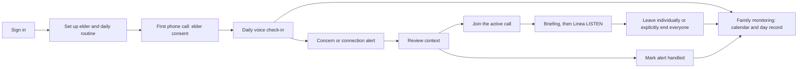

# Implementation Notes

## Scaffold delivery — 3 October 2026

The workspace now contains a Next.js family web app and FastAPI MVP backend,
with a local SQLite demo repository, production Supabase schema, typed
integration boundaries, configuration templates, tests, and repository checks.
The local demo uses synthetic data and simulated calls. Live mode deliberately
refuses startup while its provider/repository bindings are unconnected.

This delivery implements the current MVP bounds. Analytics are compact
monitoring summaries derived from the same check-in records, not a separate
trends/weekly-summary feature. The elder has no web interface. One medicine,
English conversation, and the five agreed concerns remain the scope.

### What was built

| Deliverable | Implementation |
| --- | --- |
| Native dark visual system | `apps/web/src/app/globals.css`: charcoal/purple/yellow 60/30/10 composition, softly raised/inset surfaces, semantic colors, control/card geometry, focus and reduced-motion rules |
| Brand assets | Local SVG Linea line mark and code-native voice illustration; no remote asset or font dependency |
| Sign-in | Demo entry and Supabase magic-link/callback scaffolding; server-side API proxy keeps backend bearer credentials out of the browser |
| Onboarding / profile | Three-step elder, routine, and trusted-contact form; E.164 phone validation, local timezone/calling hours, one medicine, up to three contacts; elder consent cannot be set by this form |
| Monitoring | Current-month calendar, day links, daily call card, recorded concerns, medication report counts, and accessible distribution charts/tables |
| Day record | Summary, reported medicine state, alert quotations, handled state, phone-leg history, retry/reconnection label, collapsible transcript, and expired-text state |
| Alerts | Open/all/handled views, retained exact quotation, explicit pending/Routine/Significant/Emergency labels, live-call link, idempotent handling |
| Live-call surface | Join/briefing, LISTEN display, simulated mute, member Leave, separate native-dialog End call for everyone, and scripted local review tools; no real microphone is requested in demo |
| Settings | Browser subscription registration seam, retention explanation, truthful provider connection status |
| Policy | Structured facts and deterministic five-concern rules; no keyword triage or model-supplied tiers |
| Conversation | Same-call consent continuation, refusal/stop, bounded ambiguity, unfinished beats, independent concerns, stable incident identity, correction evidence, emergency latch, fixed no-advice/review wording, and empty LISTEN completion |
| Call lifecycle | Phone legs within one logical check-in, two initial automatic attempts, 15-minute retry, one separate reconnect, saved context, stale/duplicate event protection, active-call guard, manual-success cancellation, and intentional-end suppression |
| Scheduling | Timezone/consent/calling-hours-aware placement planner and plan-only worker entrypoint; production execution remains an adapter/worker connection |
| Retention | Demo cleanup at exact 90/365-day boundaries, no expiry reset on handling, narrow consent evidence retention, and internal unenrollment helper |
| Semantic integration | Validated fact-only schema, retrieval/interpreter protocols, HTTP classifier seam, custom-LLM brain bridge, and 41 curated synthetic conversation examples |
| Supabase foundation | Relational migration for profiles/contacts/consent/check-ins/legs/alerts/details/presence/outbox/subscriptions; RLS policies, expiry routine, placement-lock helper, and manual isolation test script |
| Engineering foundation | Pinned JS/Python dependencies, environment examples, OpenAPI and interpretation contracts, formatting/linting, CI workflow, API container template, secret-presence and contrast/SQL checks |

### Family journey



Screens are `/sign-in`, `/`, `/profile`, `/alerts`, `/day/[date]`,
`/call/[id]`, and `/settings`. Detailed call data is fetched through an
authenticated, uncached server proxy. Demo data is clearly identified.

### Run locally

Use Node 20.9+ (verified here with Node 24), pnpm 11.19.0, and Python 3.12.
From the workspace root:

```powershell
pnpm install --frozen-lockfile
python -m venv .venv
.\.venv\Scripts\python.exe -m pip install -r services/api/requirements.lock.txt
Copy-Item services/api/.env.example services/api/.env
Copy-Item apps/web/.env.local.example apps/web/.env.local
```

Copy environment examples only when the destination does not already contain
your configuration. API settings load from `services/api/.env`; Next.js loads
`apps/web/.env.local`. The demo bearer token must match on both sides.
Use two terminals:

```powershell
cd services/api
..\..\.venv\Scripts\python.exe -m uvicorn app.main:create_app --factory --host 127.0.0.1 --port 8000
```

```powershell
pnpm dev
```

Open `http://127.0.0.1:3000/sign-in` and choose the demo workspace. Call now
opens a simulated call; use Simulate answer, a routine answer, or a concern
example. Join the simulated call to review the briefing/LISTEN flow. To inspect
fresh onboarding, use an empty database path and `LINEA_DEMO_SEED=0`.
Calling-hours restrictions apply in the elder's timezone in the demo too.

On this Windows workstation, `scripts/dev.ps1 -Service api` and
`scripts/dev.ps1 -Service web` also locate the bundled runtime when Node/pnpm
are absent from the normal terminal PATH. Run them in separate terminals.

SQLite data is in `services/api/.local/linea.db` when launched from the API
directory and is ignored by Git. A scheduled phone-call attempt is different
from Call now: manual calls do not consume the automatic initial-attempt budget.

### Verification evidence

- Backend: 68 tests passed for policy, conversation, lifecycle, scheduler,
  expiry, schema interpretation boundaries, authentication failure, and API
  journeys, including fresh onboarding through consent and completed history.
- Frontend: 14 automated origin-security, aggregation, and rendered-markup checks passed. These
  prove the tested content/definitions; they do not prove browser interaction.
- TypeScript and optimized Next.js build are checked separately. See the final
  verification record below for the current result.
- Declared principal text/badge foreground/background pairs pass source-level
  contrast checks (minimum tested pair 6.08:1). This is not a full accessibility audit.
- PostgreSQL parser accepts 54 migration statements and 6 manual-test-script
  statements. Supabase application and RLS behavior have not been executed.
- Python lint/format, web format, and configuration-presence checks are included.
- The pinned Starlette test client emits an httpx deprecation warning; the tests
  pass. Recheck the dependency pairing when upgrading framework/test packages.
- Browser permission policy denied the local app URL. Responsive screenshots,
  keyboard interaction, zoom, native dialog behavior, actual font shaping,
  and screen-reader checks remain unverified. No alternate browser workaround
  was used.

The 22 product/live acceptance cases in `01-test-day-checklist.md` remain NOT
RUN. Local tests do not establish their latency, phone, push, or provider-data
acceptance. The original 41 conversation fixtures are prepared as interpretation
examples; a connected semantic classifier has not passed that fixture set.

### Connections remaining before live use

1. **Supabase:** create/configure the project, apply the migration, connect a
   production repository to the service, and verify two-user/anonymous RLS
   behavior. Auth/frontend scaffolding alone does not provide backend identity
   verification or a production data layer. Resolve contacts and profile
   writes atomically and keep consent/tier/call mutations under backend policy.
2. **Semantic interpretation:** connect embeddings/retrieval and the structured
   model interpreter or HTTP classifier. Evaluate all 41 curated conversations,
   interrupted replies, subject corrections, unfamiliar phrasing, and uncertain
   ASR. Similarity/confidence never chooses a tier or fills missing negatives.
3. **Agora/Twilio:** verify the custom-endpoint envelope/authentication and map
   real phone/agent/session identity into `BrainBridge`. Connect placement,
   English ASR/TTS, fixed speech, history, participant/disconnect signals,
   reconnection, and complete teardown. Normalized events in the demo API are
   Linea-owned contracts, not assumed vendor webhook schemas.
4. **Family audio:** implement the browser `FamilyRTC` boundary and authorized
   short-lived UID/channel tokens. Token issuance does not mark a user present;
   provider-confirmed membership triggers briefing/LISTEN. Join, publish,
   subscribe, mute, leave, and remote-end behavior need actual audio testing.
5. **Notifications/workers:** connect web-push delivery to the durable revisioned
   outbox. Record sent/failed honestly and never equate sent with read. Start a
   production scheduler with transactional per-elder reservation and a retention
   worker. The SQL advisory lock must be inside the reservation transaction, not
   a separate completed HTTP RPC. Demo outbox rows contain no duplicated quotes.
6. **Failure behavior:** the emergency reply is independent of storage success
   in the tested API path. The connected runtime must retain the emergency latch
   during storage failure, queue delivery/reconciliation safely, and never wait
   for persistence/push before the fixed spoken response.
7. **Retention:** verify provider recording, history, backups, notification
   previews, and cache behavior. Stop/cancel active runtime work before
   unenrollment. Application expiry does not prove provider copies were deleted.
8. **Review and launch:** complete browser QA, the 22 live acceptance cases,
   latency measurement, and three uninterrupted full demo runs. Then initialize
   the competition repository, commit/push, configure deployment/secrets, publish
   the site/API, and prepare submission URLs/materials. No repository push,
   production deployment, or video generation is part of this scaffold delivery.

### Configuration and contracts

Backend examples are in `services/api/.env.example`; web examples are in
`apps/web/.env.local.example`. `python scripts/check-config.py` reports variable
presence without printing values; `--strict` returns failure for missing keys.
Presence does not prove validity, connection, or entitlement. Agora's imported
Twilio SIP trunk/number is configured upstream, not invented in an API payload.

`contracts/openapi.json` and `contracts/semantic-turn.schema.json` are generated
by `python scripts/export-contract.py`. The schema exposes no classifier tier.
The `ports.py`, `semantic_pipeline.py`, `bridge.py`, and browser `lib/rtc.ts`
boundaries identify where provider wiring belongs. `LINEA_MODE=live` remains a
fail-closed gate until those bindings and backend auth are implemented and
verified. Do not remove that gate merely because environment keys exist.

The underlying framework patterns were checked against the installed Next.js
guides and official [Next.js installation guidance](https://nextjs.org/docs/app/getting-started/installation),
[Supabase server-side Auth guidance](https://supabase.com/docs/guides/auth/server-side),
and [FastAPI testing guidance](https://fastapi.tiangolo.com/tutorial/testing/).

The reference ZIP and extracted handoff are preserved. Application source,
tests, stylesheet processing, and API container copies are scoped to the new
app directories; archival source does not enter the application build.

### Final verification record

Final checks on 3 October 2026:

| Check | Current evidence |
| --- | --- |
| Backend pytest | 68 passed, 1 dependency deprecation warning |
| Frontend tests | 14 passed, 0 failed |
| TypeScript | Passed |
| Optimized Next.js build | Passed; all declared app/API routes generated |
| Web formatting | Passed |
| Python lint and formatting | Passed |
| Declared color-pair contrast | 9 pairs passed; minimum tested ratio 6.08:1 |
| PostgreSQL syntax parsing | Migration: 54 statements; manual test script: 6 statements |
| Scheduler worker | Plan-only entrypoint executed and returned an eligible proposal; no phone call placed |
| Configuration check | Executed; provider key groups are missing, as expected for this unconnected scaffold |
| Contract/inventory checks | Required screens/assets/contracts present; 41 curated examples; no tier field in interpretation schema; dependency versions pinned |
| Windows launcher | PowerShell syntax parsed successfully |
| API process | Updated factory entrypoint started and completed application startup locally |
| Browser / live provider / Supabase RLS | Not verified; remain follow-up gates |

Post-delivery correction: the session and backend proxy origin checks now use
the original request Host rather than NextURL's loopback-normalized hostname.
This allows the browser's actual `127.0.0.1` origin while retaining strict
scheme/host/port matching. Five regression checks cover loopback normalization,
localhost/HTTPS, foreign origins, forwarded-host spoofing, and cross-site metadata.

Scaffold delivery is complete at the local source/build/test level. Integration
and acceptance work above remains required before any live-product claim.

## Responsibility boundaries

### Agora

-   realtime channel
-   managed agent runtime
-   telephony bridge
-   ASR/TTS execution
-   speak/think/leave/history

### FastAPI

-   product/business rules
-   semantic classification orchestration
-   safety policy
-   consent
-   medicine state
-   family join authorization
-   listen mode
-   retry state
-   persistence

### Supabase

-   Auth
-   Postgres
-   RLS
-   optional Storage

### Next.js

-   family-facing web UI

## MCP

If Agora/Supabase MCP integrations are available: - use them for setup,
inspection, schema work, diagnostics, or supported infrastructure
actions - verify exact tool schemas before use - do not put Linea policy
into MCP - do not make the product dependent on undocumented MCP
behavior

## Do not invent

For uncertain: - API fields - webhook payloads - provider models - voice
names - retention settings - MCP operations

verify current documentation/tooling or use a confirmed fallback.
