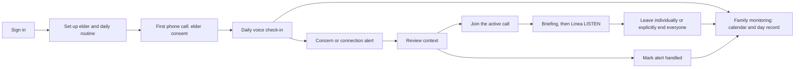

# Implementation Notes

## Calling rejection recovery and worker diagnostics — 4 October 2026

Agora placement responses with HTTP 401, 403, 404 or 422 now explicitly fail the
phone leg and release its active-call reservation through the existing lifecycle
policy. The failed attempt remains recorded. Other errors, including 400 (which
may represent a provider conflict), 408, 409, 429, server failures and timeouts,
remain uncertain and require reconciliation rather than an automatic second call.
Recovery also handles an interruption between saving a rejection and marking its
command failed. No existing uncertain records are changed by this patch.

Worker failures now log the operation, exception type and HTTP status. Exception
messages, provider bodies, request URLs and credentials are excluded. These logs
distinguish an authorization/schema rejection from a transport or database error.
Targeted voice-runtime, lifecycle and connected API verification passed: 42 tests.

This patch does not start a worker or enable calls. The hosted runtime accepted
the locally configured completion bearer and webhook HMAC during deliberately
invalid, non-mutating validation probes. This verifies local/server agreement,
not an Agora-originated signature. The configured Supabase project still had no
worker heartbeats or queued call commands during the check. The hosted operator
must confirm the actual Agora notification secret and inspect `linea-voice`
status/logs. Existing consent, account scope and 06:00–21:00 elder-local calling
hours remain enforced; no acceptance evidence or heartbeat was fabricated.

## Saved profile calling setup repair — 4 October 2026

The user confirmed the profile is saved. Private scope was configured from the
unique existing enrolled profile matching the already authorized recipient and
its actual owner; no identity was added to source or database records. Voice
construction succeeded as root, but service-identity testing found the speech
file under `/etc/linea` inaccessible to `linea`: the parent directory is root-only
0700. The file was copied to `/opt/linea/config/agora-properties.json`, with a
root-owned 0750 directory and root:linea 0640 file. `/etc/linea`, environment
files, backups and previous speech configuration retained their permissions.

The actual `linea` service identity can now read the speech properties, write
the private recovery journal and construct the scoped runtime successfully.
A candidate scoped API started under that identity and passed health before
the private environment was activated and the API restarted. Runtime settings
are now connected mode, voice=1, scoped test=1, push=0, using only the saved
profile/owner pair. The voice worker remains disabled/inactive. This prepares
provider callback handling without authorizing calls through a fake heartbeat.

The 04:52 Manila/Singapore audit confirmed one matching private scope and zero
active phone/provider sessions, runtime calls, commands, callbacks, retries,
recovery files or due scheduler proposals. The actual notification Secret
remains unchanged and unverified; the user was asked to confirm installation
from Agora Console. No calls have been placed. The dashboard correctly stays
disconnected while no actual voice worker heartbeat exists. General live mode
is gated; the earliest permitted phone call remains 06:00 true elder local time.
All phone/audio/LISTEN/result/rehearsal evidence remains NOT RUN.

## Hosted family app and recording blockers — 4 October 2026

Continuation at 04:44 Manila/Singapore rechecked the same blockers: matching
recipient profile still has pending consent, the notification Secret is unchanged
and unverified, private scope is unset, and no browser automation is enabled.
No calls were placed. `scripts/preflight-calling.py` now provides a read-only
operator audit, installed separately at `/opt/linea/ops/preflight-calling.py`.
It includes future commands, pending retry/reconnection schedules, temporary
and encrypted recovery files, actual scoped calling hours, scheduler proposals
and provider agents. Four local regression cases verify privacy, scope/hour
blocking and that scheduled/queued work is not hidden. Its hosted snapshot found
zero outstanding work/resources and correctly returned BLOCKED for unset scope.
See `deploy/README.md` for the operator command. This tool never starts workers
or supplies calling authorization/readiness/acceptance evidence.

The actual family app is now deployed at https://linea.aldrinvitorillo.dev,
using source commit `098e52a8a6e2ef44169f8446c200c82fbcc0c020`, also used by
the hosted API. The domain previously had no frontend service and returned
the API domain's TLS certificate. The repair installed the immutable frontend
release, `linea-web.service` under the existing `linea` service user, a separate
Nginx virtual host, and a valid Let's Encrypt certificate. Existing API/SIP
configuration and the server checkout's package edits were preserved.

The private frontend environment is `/etc/linea/web.env`; its app origin is the
public HTTPS frontend. Only the public Supabase and VAPID keys enter the browser.
The frozen dependency install and production build passed on the server.
HTTPS sign-in/signup pages return 200, unauthenticated dashboard requests return
401, malformed sign-in and unavailable demo actions return 400, and cross-origin
session requests return 403. These HTTP checks do not verify a browser session.
Local type checking, 33 web tests, and 26 voice-runtime/connected tests passed;
the existing regression/smoke report also passed its six automated subchecks.

Documented English ARES ASR and Agora-managed OpenAI TTS (`tts-1`, `alloy`) are
staged in `/etc/linea/agora-properties.json`. This replaces the missing speech
configuration blocker with a configuration requiring actual phone validation.
Sources: [ARES](https://docs.agora.io/en/ai/models/asr/ares),
[OpenAI TTS](https://docs.agora.io/en/ai/models/tts/openai).
The notification Secret remains unchanged from the earlier unverified setup;
Console callback configuration and provider-originated signatures are unverified.
Follow [Agora's webhook setup](https://docs.agora.io/en/ai/build/handle-runtime-events/webhooks).

The user explicitly authorized one normal check-in and two rehearsals for the
consenting teammate, including policy retries/reconnection. Private inspection
found exactly one enrolled profile matching that recipient, pending consent,
real timezone Asia/Manila and scheduled time 08:00. The owner must still verify
that profile through normal sign-in before its IDs are configured as private scope.
No accounts, profiles, history, consent, alerts or call outcomes were created,
seeded, deleted or reset during this preparation.

At inspection there were zero runtime calls, queued/inflight/uncertain commands,
pending callbacks, recovery files, scheduler proposals and active provider agents.
The voice service remains disabled/inactive, with voice, test mode and push disabled.
The actual clock was 04:33 on 4 October in Manila/Singapore: calls must wait until
06:00 elder local time, without changing the profile's timezone or calling rules.
Recheck all work immediately before starting the scoped worker. No call was placed.

No browser automation surfaces are enabled for this session (`Browser is not
available: iab`). Actual signup/sign-in/profile QA, microphone permission,
ringing, conversational consent, speech, Significant alerts, family two-way audio,
LISTEN silence, hangup, saved call records, refresh persistence and both rehearsals
remain NOT RUN. Push is unverified. The complete acceptance matrix is unchanged;
general live mode remains gated. See `testing/RECORDING-RUNBOOK.md`.

## Actual-product recording preparation — 4 October 2026

The recording uses normal email/password signup and an app-created profile with
a consenting teammate's phone. This supersedes earlier special/synthetic-profile
setup instructions. IDs may be configured privately for scope only after verifying
the real account/profile and recipient authorization; they are never source-code
defaults. Consent/history are preserved across takes. No accounts or production
records were created or seeded during this preparation.

The provider completion adapter previously rejected OpenAI-compatible messages
without a `turn_id`, which Agora's documented request does not require. It now
derives a deterministic identity from the authenticated message history when the
provider omits that field. Exact retries are deduplicated; identical words in later
history are distinct. Invalid explicit IDs, completion authentication, active-leg
validation, and readiness gates remain enforced. Actual provider history behavior,
including repeated/truncated histories, still needs real-call verification.
Reference: [Agora custom LLM guide](https://docs.agora.io/en/ai/build/custom-model-integration/custom-llm).

All 19 voice-runtime regression cases pass, including new envelope/retry cases.
The current repository's private web configuration now targets the hosted API
instead of local port 8002, and the optimized web build passes. This does not
verify the separately running older-snapshot frontend or a hosted frontend URL.

See `testing/RECORDING-RUNBOOK.md` for a normal call, two concern/family-join
rehearsals, microphone/feedback setup, exact existing controls, privacy cropping,
actual-record persistence, cleanup checks, and deferred acceptance. Actual browser
and phone rehearsals remain NOT RUN: browser/Agora Console access, verified provider
configuration, frontend URL, and explicit recipient/session authorization are
still missing. Push is secondary and unverified. General live mode remains gated.

The compatible API release is prepared on an isolated Git branch so the primary
checkout's local changes and the server's package edits remain intact. The exact
active deployed build is recorded privately in `/etc/linea/backend.env` and
`/etc/linea/setup-status.md`; the previous deployment details below are historical.

## Hosted provider setup progress — 4 October 2026

The current Git checkout is `D:\Hackathon\Agora\Linea`; the supplied
`D:\Hackathon\linea` directory is an older snapshot without Git metadata.
Both local and server `pre-deployment` matched remote commit
`4d16f362711539adb5ec81c64bf9c1307f1189d4` after fetch. The local checkout
started clean. Server edits to `package.json` and its untracked `package-lock.json`
were preserved, with private backups under `/etc/linea/`. No force reset, migration
reapplication, or SIP-trunk modification was performed.

The API now runs as the dedicated `linea` user under enabled `linea-api.service`,
behind the existing HTTPS Nginx proxy. Its immutable application release is
`/opt/linea/releases/4d16f362711539adb5ec81c64bf9c1307f1189d4`, selected by
`/opt/linea/current`; Python 3.12 locked dependencies are installed in
`/opt/linea/venv`. The private environment is `/etc/linea/backend.env` (0600).
The shared persistent journal is `/var/lib/linea/runtime-journal` (0700,
owned by `linea`). The API and prepared voice unit use the same environment and
completion bearer. These paths supersede editing the old checkout's `.env` for
the running service. Access logging is disabled for the API; systemd supervises
startup/restart and records lifecycle logs.

Read-only credential checks returned HTTP 200 for Supabase service-role runtime
reads, Agora agent listing, Twilio owned-number/trunk inspection, and access to
the configured OpenAI model. The sole owned voice number, already associated
with the existing SIP trunk, supplied `AGORA_FROM_NUMBER`. The public API URL
and deployed build ID are configured. Existing secrets were preserved privately;
presence or model access does not prove voice execution or interpretation quality.

Migration history confirms `20261003193503_voice_runtime`. All five private
runtime tables have RLS enabled and deny anonymous/authenticated access; all
eight runtime/retention functions retain fixed empty search paths and service-role
execution only. The database had zero runtime calls, commands, callback events,
and worker heartbeats. The read-only scheduler returned no placement proposals;
the existing profile's consent is pending. Recheck these immediately before any
worker start, since this is a point-in-time observation.

Hosted `/health` and `/openapi.json` returned 200. Missing/invalid dashboard
authentication and unsigned/invalid provider signatures returned 401. The
completion route accepted the installed bearer far enough to return the expected
503 for an unconfigured voice runtime. This does not verify an Agora-originated
signature. The smoke runner now recognizes connected-mode health without passing
the separate live-readiness gate; its deployment health/contract/auth checks pass.

Remaining blockers: no enabled browser/Console access to obtain Agora's actual
notification Secret or configure its telephony callback, no verified English
ASR/TTS properties JSON, no agreed normally-created profile/owner and explicit recipient
authorization, and no authenticated test-owner session for scoped dashboard QA.
The existing generated webhook candidate is not provider evidence. The local
environment helper no longer generates webhook candidates.

`linea-voice.service` is installed **disabled and inactive**; it also checks
`LINEA_VOICE_ENABLED` before starting. Voice and push remain disabled in connected
mode. No heartbeat was fabricated, no call/model inference/push was sent, and no
acceptance result was marked passed. Ringing, conversation, family audio, hangup,
persisted call records, and the full 22-case acceptance run remain NOT RUN.
See `deploy/README.md` and the acceptance section below before starting workers.

## Supabase voice runtime implementation — 4 October 2026

This entry supersedes the calling-readiness and scaffold status below. The user
confirmed that their teammate will pull the repository and update the hosted
server manually. Source changes are in the current `keith-branch` working tree;
this session has not committed, pushed, or deployed them.

On 4 October 2026, Supabase MCP applied the voice-runtime migration to the
configured project `yerrtkosxksacqxznrhk`. The database records it as
`20261003193503_voice_runtime` (MCP-generated version). The source file remains
`supabase/migrations/202610040002_voice_runtime.sql`; do not apply it again to
this project. The application server update is still the teammate's manual step.

Implemented the Agora outbound call/speech/teardown adapter, short-lived family
RTC credentials and browser audio, the strict OpenAI fact interpreter, authenticated
custom completion responses, signed telephony callbacks, and durable Supabase
runtime state and queues. Per-elder leases serialize changes, placement requests
are idempotent, and uncertain placements are reconciled by their unique provider
channel instead of automatically placing a second billed call. Token issuance
does not mark family present: the API confirms membership with Agora first.
Family audio controls currently authorize the profile owner; telephone contacts
are not additional authenticated app members.

Scheduling, retries, callback processing, provider reconciliation, notification
delivery, and retention now have executable workers. Notification revisions are
claimed with leases; delivery status is stored honestly and expired subscriptions
are removed. Emergency speech precedes persistence, with encrypted recovery on a
shared private volume. A known emergency latch continues its fixed response during
a database outage. Recovery files expire with detailed text after 90 days.

### Verified state and limits

| Component | Latest observation |
| --- | --- |
| Current checkout API, `http://127.0.0.1:8002/health` | HTTP 200; `mode=connected`, `repository=supabase`, voice and push disabled |
| Current checkout web configuration | Both mode variables are `connected`; server API URL points to port 8002 |
| Other local APIs on ports 8000/8001 | Existing processes were left alone; they are not evidence about this checkout |
| Hosted API, `https://lineaapi.aldrinvitorillo.dev/health` | Latest check returned HTTP 502; manual server release remains pending |
| Runtime migration | Applied successfully through Supabase MCP to the configured project; remote migration record verified |
| Automated verification | 101 backend tests (including 5 PostgreSQL integration tests) and 33 browser tests pass; type checking, Ruff, formatting, SQL parsing, and production web build pass |
| Interpreter | Two synthetic requests to the pinned OpenAI model passed; this is not a voice latency or full conversation-fixture acceptance run |
| Real phone/audio/push acceptance | NOT RUN; no telephone called and no provider configuration changed in this session |

Post-migration checks confirmed five new private tables with RLS enabled, seven
new columns, and eight runtime/retention functions with fixed empty search paths.
Anonymous and authenticated browser roles cannot read/write the private tables
or execute these functions; the service role has the required access. The
runtime's actual Supabase Data API read succeeded, including its relational
check-in join. Existing profile/contact/consent counts were unchanged.

The security advisor's
[RLS-without-policy notices](https://supabase.com/docs/guides/database/database-linter?lint=0008_rls_enabled_no_policy)
are expected for service-only queues. Existing baseline advisories remain for
[anonymous-callable definer helpers](https://supabase.com/docs/guides/database/database-linter?lint=0028_anon_security_definer_function_executable),
[authenticated-callable definer functions](https://supabase.com/docs/guides/database/database-linter?lint=0029_authenticated_security_definer_function_executable),
and [disabled leaked-password protection](https://supabase.com/docs/guides/auth/password-security#password-strength-and-leaked-password-protection).
These were not introduced by the runtime migration; its functions are all
service-role-only. No Auth settings or existing family-access policies were
changed during migration application.

### Manual release: keep both environments on Supabase

1. Review and commit/push this working tree through the team's normal release
   process, then pull that commit on the server. Record the deployed commit.
2. The voice-runtime migration is already applied to the existing Supabase
   project; verify its `voice_runtime` migration record instead of reapplying it.
   For a fresh project, apply all three migrations in filename order.
   The new private tables and RPCs are service-role-only; family profile
   and history requests continue to use the authenticated user's JWT and RLS.
3. Install `services/api/requirements.lock.txt` with Python 3.12. Install web
   dependencies with `pnpm install --frozen-lockfile`, then build the web app.
4. Configure the private backend environment with `LINEA_MODE=connected`, the
   existing `SUPABASE_URL` and `SUPABASE_PUBLISHABLE_KEY`. Leave
   `LINEA_VOICE_ENABLED=0` and `LINEA_PUSH_ENABLED=0` for the records-only release.
   Start/restart the API from `services/api` behind the existing HTTPS proxy:

   ```sh
   python -m pip install -r requirements.lock.txt
   uvicorn app.main:create_app --factory --host 127.0.0.1 --port 8000
   ```

5. Configure the Next.js server with `LINEA_MODE=connected`,
   `NEXT_PUBLIC_LINEA_MODE=connected`, and
   `LINEA_API_URL=https://lineaapi.aldrinvitorillo.dev`. Supply only the public
   Supabase URL/key to `NEXT_PUBLIC_SUPABASE_*`. Restart the web server.
6. Check both local and hosted `/health`: each must report `mode=connected` and
   `repository=supabase`. Resolve the hosted 502 before provider testing. Verify
   authenticated save/reload and account isolation. Disabled voice/push are
   expected until the following setup and acceptance work is completed.

### Provider setup and authorized acceptance testing

Provision the backend's private service-role key, Agora app/certificate/REST
credentials, owned SIP `AGORA_FROM_NUMBER`, OpenAI key, shared completion bearer,
and Agora's **actual** project notification signing secret. A locally generated
candidate webhook secret is insufficient. Set `LINEA_PUBLIC_API_URL` to the
public HTTPS API and configure the project's telephony notifications to POST to
`/provider/agora/events`. The per-leg completion URL/bearer is installed in each
outbound call by the adapter. Supply verified English ASR/TTS properties in an
ignored JSON file referenced by `LINEA_AGORA_PROPERTIES_FILE`; a pipeline ID alone
is insufficient. The adapter requests `parameters.opt_out=true`; confirm provider
retention behavior during acceptance. Never put these secrets in browser values.

Mount one persistent private `LINEA_RUNTIME_JOURNAL_PATH` into the API and voice
worker, using the same completion bearer for encryption. Keep it writable by the
service user, restrict access, and retain the key while pending recovery exists.
For explicitly authorized test calls only, set `LINEA_VOICE_ENABLED=1`,
`LINEA_VOICE_TEST_MODE=1`, and `LINEA_TEST_ELDER_ID` / `LINEA_TEST_OWNER_ID`
from the verified normally app-created profile and its signed-in owner.
Keep `LINEA_MODE=connected`: this confines voice execution
to that profile and owner while acceptance remains incomplete.

Run separate supervised worker processes from `services/api`:

```sh
python -m app.worker --execute --role voice
python -m app.worker --execute --role notifications
python -m app.worker --execute --role retention
```

The retention worker can run in connected mode without voice acceptance. For push
testing, install matching public/private VAPID keys and subject, enable
`LINEA_PUSH_ENABLED=1`, and verify actual browser delivery. The public key alone
does not establish delivery. Voice/push readiness also requires a recent worker
heartbeat; the API does not launch workers itself. Execution without `--execute`
only plans calls and never contacts the phone provider.

Follow [testing/README.md](testing/README.md) and record all 22 MVP acceptance
cases against the deployed build. An acceptance JSON file must contain `tester`,
`tested_at`, `build`, and a `cases` object mapping every `MVP-01` through `MVP-22`
to `passed`, backed by the test-run evidence. Set `LINEA_BUILD_ID` to the same
build and `LINEA_LIVE_ACCEPTANCE_FILE` to its private file path. Only after that
run passes, disable scoped test mode and enable `LINEA_MODE=live`. No acceptance
record was fabricated or enabled by this implementation.

Provider contracts were checked against the primary
[Agora REST specification](https://github.com/AgoraIO/docs-portal/blob/main/content/openapi/conversational-ai/rest-api.en.yaml),
[telephony SDK](https://github.com/AgoraIO/agora-agents-go/blob/main/telephony.go),
[runtime webhook guide](https://github.com/AgoraIO/docs-portal/blob/main/content/docs/en/ai/build/handle-runtime-events/webhooks.mdx),
and [OpenAI Structured Outputs documentation](https://developers.openai.com/api/docs/guides/structured-outputs).

## Calling readiness and teammate deployment — 4 October 2026

The user confirmed that their teammate deploys `lineaapi.aldrinvitorillo.dev`.
Read-only checks during the calling investigation found:

| Component | Observed result |
| --- | --- |
| Local API, `http://127.0.0.1:8000/health` | HTTP 200; `mode=connected`, `repository=supabase`, `voice_connected=false` |
| Hosted API, `https://lineaapi.aldrinvitorillo.dev/health` | HTTP 200; `mode=demo`, `repository=supabase`, `voice_connected=false` |
| Hosted `/openapi.json` | HTTP 200; demo call routes exist, but no provider callback or custom completion routes |
| Twilio account using the local API credentials | Read access works; one voice-capable number and one SIP trunk exist |
| Agora and interpretation configuration | Credentials and a pipeline ID are present locally; this does not verify the published pipeline or a live call |

The earlier HTTP 502 is resolved. Restarting the server or changing the frontend
API URL alone will not enable calling. The local connected backend deliberately
returns 503 for call placement. `UnconnectedVoiceRuntime` is still a placeholder,
and `LINEA_MODE=live` deliberately refuses startup. No phone was called during
this investigation, no provider settings were changed, and nothing was deployed.

### Deploy the working account and records backend first

The connected-workspace changes are included in this `keith-branch` update.
Pull the latest branch through the team's normal Git review/release process
before deployment; the previously hosted demo does not include these changes.
Use Python 3.12 and `services/api/requirements.lock.txt`, or build the existing
Dockerfile with `services/api` as its build context. Configure the backend's
private environment with:

```dotenv
LINEA_MODE=connected
SUPABASE_URL=<the existing project's HTTPS URL>
SUPABASE_PUBLISHABLE_KEY=<the existing project's public key>
```

The existing project already has both checked-in Supabase migrations applied.
For a different project, apply both migrations in filename order first. Do not
copy `.env` files into Git or put backend secrets in browser environment values.
Connected profile access uses the public key plus the authenticated user's JWT;
the service-role key is not required for these account/profile requests.

For a host process, run from `services/api` behind the existing HTTPS proxy:

```sh
python -m pip install -r requirements.lock.txt
uvicorn app.main:create_app --factory --host 127.0.0.1 --port 8000
```

After release, the hosted health response must report `mode=connected` and
`repository=supabase`. Verify authenticated profile save/reload and cross-account
isolation before setting the Next.js server's `LINEA_API_URL` to the hosted URL
and restarting it. The web mode variables must remain `connected`. Calling will
still correctly report unavailable after this release.

### Implementation required before enabling the call button

1. Implement Agora outbound call placement, scoped RTC tokens, speech delivery,
   and teardown in `services/api/app/ports.py`'s runtime interface. Verify the
   published pipeline's SIP, ASR, TTS and custom-completion settings against the
   current provider contract. The presence of a Twilio trunk does not establish
   that all these settings work together.
2. Implement the fact-extraction model adapter and the authenticated Agora
   custom-completion HTTP endpoint around `BrainBridge`. Preserve deterministic
   consent, safety rules and empty completions during LISTEN. The model chooses
   neither escalation tiers nor unscripted medical advice.
3. Add authenticated, replay-safe provider callbacks, durable check-in/policy
   state, call-leg events and alert writes in Supabase. Call creation and callback
   processing need atomic ownership/idempotency checks; the connected repository
   currently reads call records but does not run a provider session.
4. Connect the scheduling/retry and notification workers, plus authorized family
   voice participation and end-call controls, before claiming the automated
   welfare-check workflow works. Provision the shared completion bearer and the
   provider's actual signing configuration privately on the server. The locally
   generated webhook secret remains a candidate, not a verified provider key.
5. Deploy those routes on the HTTPS backend, configure Agora to reach them, and
   verify signed events and completion authentication. Then run an explicitly
   authorized test call, confirm answer/end behavior, saved records, consent,
   alerts, retries, and family controls using `testing/README.md`. Enable the
   frontend capability only once the corresponding runtime path is verified.

The deployment URL supplies public reachability for provider requests; the
implementation above is a separate prerequisite. Do not remove the live-mode
gate or return `voice_connected=true` merely to make the button clickable.

## Email/password accounts — 4 October 2026

The connected app now uses email and password at `/sign-in`, with a separate
`/sign-up` page (email, password and password confirmation). Passwords go directly
from the same-origin server route to Supabase Auth; Linea stores no password copy
and returns no session tokens to the form. The server sets the existing Supabase
SSR session cookies. Magic-link login has been removed from the session endpoint.

The user explicitly approved disabling email confirmation for this development
project after registration hit `over_email_send_rate_limit` (the built-in mailer
has a project-wide quota of two emails per hour). `mailer_autoconfirm=true` is now
configured in Supabase. Signup creates a session immediately and accepts non-team
email addresses without proving mailbox ownership. Password authentication and
user-scoped RLS remain enabled. This is a project-wide development setting; enable
confirmation and configure a working email provider before a public rollout.
The callback remains available for previously issued links or future confirmation.

Verification: 30 frontend tests, typecheck and production build passed. The real
connected verification script now signs in with a temporary account's password,
checks incorrect credentials and foreign origins are rejected, saves/reloads
records, signs out, signs back in, and verifies the records remain. Temporary test
accounts and records were removed. `python scripts/verify-connected.py --run
--signup` additionally passed with two fresh registrations through the actual web
session endpoint, immediate authenticated dashboard access, sign-out, and password
re-login. Without `--signup`, test users are admin-created and registration itself
is not exercised. Email quota errors now explain the confirmation-email limit
separately from excessive login attempts. No confirmation email is needed or sent
in the current development configuration.

## Connected family workspace — 4 October 2026

`LINEA_MODE=connected` now runs the real family workspace: Supabase email sign-in,
verified backend identity, and user-scoped Postgres reads/writes under RLS.
Profiles, daily routine and contacts save together in one database transaction;
new elder consent stays pending. Existing check-ins and alerts can be read, and
alert handling is idempotently persisted. No sample records are seeded in this
mode. SQLite demo data is not migrated into real accounts.

The connected migration is `supabase/migrations/202610040001_connected_workspace.sql`.
It was applied to the configured Supabase project through the Management API.
It adds owner-checked profile and alert functions and removes direct elder writes
that could create a profile without contacts. The running API uses the public key
and the signed-in user's access token, not the service-role key. The management
token used during setup is not stored in the repository or application environment.

The local configuration now has `LINEA_MODE=connected` in both environment files,
`NEXT_PUBLIC_LINEA_MODE=connected`, and
`NEXT_PUBLIC_APP_URL=http://127.0.0.1:3000`. Both loopback callback URLs are on the
project's Auth redirect allowlist. Start API and web using the existing commands
below, then open `http://127.0.0.1:3000/sign-up` to register or `/sign-in` to enter
your email and password. The callback also supports a Supabase email `token_hash`
for custom email templates if confirmation is enabled later.

The built-in mailer is still configured, but development signup no longer uses it.
Delivering account emails to arbitrary family addresses will require custom SMTP.
See https://supabase.com/docs/guides/auth/auth-smtp.

Phone calls, simulation endpoints and family voice controls are disabled in
connected mode, with clear UI status. Push subscriptions can be stored, but push
delivery is still unconnected. Fully automated voice (`LINEA_MODE=live`) remains
gated; saving a call preference does not schedule or place calls. The older
integration notes below describe the state before this connected workspace work.

Verification: backend and frontend suites, typecheck, formatting/linting, SQL
syntax parsing and production build passed. `python scripts/verify-connected.py
--run` also passed against the configured project and running local web/API. It
created two disposable users without sending email, exercised the Auth callback,
SSR session cookies and frontend proxy, created/edited/reloaded profile/contact
records, verified failed edits roll back atomically, tested cross-account RLS/API
denials, read real persisted call detail, handled an alert twice without resetting
its timestamp, and verified disabled simulations and sign-out. All generated
users and records were removed. The script requires a service-role key only for
creating and cleaning up its exact test records; normal app access does not.

## Integration preparation — 4 October 2026

Handoff is on `keith-branch`, including the preparation commit from
`codex/integration-preparation`, based on `ui-ux-first-pass`.
The existing scaffold/UI branches remain unchanged. The agreed target is one
backend model interpretation request per new elder turn, followed by
deterministic policy and scripted responses. The interpreter and verified Agora
completion adapter still need implementation; no live connection was enabled.

### Credential and deployment checklist

| Item | Status | Next action |
| --- | --- | --- |
| Agora App ID/certificate, REST customer pair, published pipeline ID | Stored in ignored backend environment; project and REST access previously verified | Verify the actual custom completion and provider event contracts, then configure the published agent |
| Twilio account and API key credentials | Stored locally; trunk reads previously verified | Keep the working SIP trunk; do not reset its password |
| Supabase URL, public key, service key | Stored locally; Auth settings and zero-row Data API access previously verified | Implement backend identity/repository bindings and test owner isolation |
| OpenAI API key | Stored in ignored local backend environment; read-only model access returned HTTP 200 | Install `OPENAI_API_KEY` separately in the server environment; the key is not included in Git |
| Interpreter model | Planned `gpt-4.1-mini-2025-04-14` snapshot | Implement fact extraction, evaluate fixtures, and measure tokens/latency; configuration alone does not run a model |
| Backend completion bearer | Generated in ignored `services/api/.env` | Install the same value in the backend deployment and Agora custom endpoint configuration |
| Provider webhook secret | Candidate generated locally | Verify Agora's signing contract and install the matching provider configuration; this is not yet an authenticated webhook |
| Web-push VAPID pair | Generated and mathematically matched | Deploy private key on backend and public key on web; wire the outbox sender and test actual delivery |
| Web-push contact subject | Prepared with the supplied API HTTPS URL | Replace with an operator contact URL or email before production |
| Deployment access / instructions | **Needed from user or teammate** | Supply the server repository, deployment command or access method, and environment configuration method |
| Remote API health | `/health` returned **502** on 4 October | Restore the upstream API before remote integration tests |
| Twilio Auth Token | Conditional; not supplied | Needed only if directly verifying Twilio callbacks; the API key secret is not a webhook Auth Token |
| Existing SIP credential password | Conditional; not supplied | Needed only if upstream trunk authentication must be configured again; Twilio cannot return the original password |

`scripts/prepare-integration-env.mjs` (Node 24+) creates missing completion and
candidate webhook secrets plus a P-256 VAPID pair, validates existing push keys,
and copies only the public push key to the web environment. It refuses tracked
credential files, incomplete/mismatched key pairs, and conflicting browser keys.
It preserves existing credentials and prints names/status only. To prepare a new
checkout, supply an operator contact URI:

```powershell
node scripts/prepare-integration-env.mjs --push-subject https://lineaapi.aldrinvitorillo.dev
python scripts/check-config.py
```

The example HTTPS URI is the user's server endpoint; choose a contact URI for a
real deployment. Neither command connects providers or enables live mode.
`check-config.py` now checks the planned backend model credentials by default;
if either external classifier setting is supplied, it instead requires both
external URL and bearer token. An external service is an alternative interpreter,
not an additional model to run alongside it.

Local verification: the generated VAPID public key derives from its private
scalar, the browser key matches, both credential files are ignored/untracked,
and a second preparation run leaves both files byte-for-byte unchanged. Backend
identity verification, provider event authentication, model extraction accuracy,
phone calls, and push delivery remain unverified. The demo/live gate stays intact.

### Teammate server handoff

Pull `keith-branch`. No credentials are committed: the local backend `.env` and
web `.env.local` are ignored and do not travel with the branch. Install the
backend credentials through the server's private environment configuration,
including `OPENAI_API_KEY`. Share existing internal/VAPID credentials securely
when connecting web, API, and Agora; generating different credentials on each
component will not connect them. Never place the OpenAI key, push private key,
service-role key, or provider secrets in `NEXT_PUBLIC_*` variables.

To restore the API process first, install the pinned requirements and run the
existing factory under Python 3.12. From `services/api`:

```sh
python -m pip install -r requirements.lock.txt
uvicorn app.main:create_app --factory --host 127.0.0.1 --port 8000
```

Alternatively, the repository includes `services/api/Dockerfile`; build from
that directory as the Docker context and inject environment variables at run
time. Keep `LINEA_MODE=demo` while restoring the server: `live` intentionally
refuses startup until the repository, runtime, and notification adapters are
implemented. Use a strong matching `LINEA_DEMO_API_TOKEN` in the backend and
Next.js server environment if exposing the demo API. Persist `.local` if demo
records must survive container replacement.

Point the existing reverse proxy at the actual listening port and verify
`https://lineaapi.aldrinvitorillo.dev/health` and `/openapi.json` return HTTP 200.
The health response will still truthfully identify `sqlite-demo`,
`voice_connected=false`, and `push_connected=false`. Do not switch the family
app to this remote API until its health, authentication, and required routes
are verified. The model-access HTTP 200 proves key access to the planned
snapshot; no inference was billed or extraction accuracy evaluated.

## Scaffold delivery — 3 October 2026

The workspace now contains a Next.js family web app and FastAPI MVP backend,
with a local SQLite demo repository, production Supabase schema, typed
integration boundaries, configuration templates, tests, and repository checks.
The local demo uses synthetic data and simulated calls. Live mode deliberately
refuses startup while its provider/repository bindings are unconnected.

This delivery implements the current MVP bounds. Analytics are compact
monitoring summaries derived from the same check-in records, not a separate
trends/weekly-summary feature. The elder has no web interface. One medicine,
English conversation, and the five agreed concerns remain the scope.

### What was built

| Deliverable | Implementation |
| --- | --- |
| Native dark visual system | `apps/web/src/app/globals.css`: charcoal/purple/yellow 60/30/10 composition, softly raised/inset surfaces, semantic colors, control/card geometry, focus and reduced-motion rules |
| Brand assets | Local SVG Linea line mark, user-supplied gradient for human avatars, and Libraries.dev bot avatar in the call participant row; no remote asset or font dependency |
| Sign-in | Demo entry and Supabase magic-link/callback scaffolding; server-side API proxy keeps backend bearer credentials out of the browser |
| Onboarding / profile | First-use four-step elder/routine/contacts/review flow, including prefilled demo setup; compact section tabs for subsequent edits; E.164 validation, local calling hours, one medicine, up to three contacts; elder consent cannot be set by this form |
| Monitoring | Shared month control, daily logical check-in activity chart (completed/in progress/incomplete), recorded-day outcome ring, medicine report bars with count/share tables, calendar/day links, daily call card, and recorded concerns |
| Day record | Summary, reported medicine state, alert quotations, handled state, phone-leg history, retry/reconnection label, collapsible transcript, and expired-text state |
| Alerts | Open/all/handled log with recorded time, concern, exact quotation, tier, handled state, live-call/day links, and expandable assessment metadata; compact rows on monitoring |
| Live-call surface | Join/briefing, LISTEN display, simulated mute, member Leave, separate native-dialog End call for everyone, and scripted local review tools; no real microphone is requested in demo |
| Settings | Browser subscription registration seam, retention explanation, truthful provider connection status |
| Policy | Structured facts and deterministic five-concern rules; no keyword triage or model-supplied tiers |
| Conversation | Same-call consent continuation, refusal/stop, bounded ambiguity, unfinished beats, independent concerns, stable incident identity, correction evidence, emergency latch, fixed no-advice/review wording, and empty LISTEN completion |
| Call lifecycle | Phone legs within one logical check-in, two initial automatic attempts, 15-minute retry, one separate reconnect, saved context, stale/duplicate event protection, active-call guard, manual-success cancellation, and intentional-end suppression |
| Scheduling | Timezone/consent/calling-hours-aware placement planner and plan-only worker entrypoint; production execution remains an adapter/worker connection |
| Retention | Demo cleanup at exact 90/365-day boundaries, no expiry reset on handling, narrow consent evidence retention, and internal unenrollment helper |
| Semantic integration | Validated fact-only schema, retrieval/interpreter protocols, HTTP classifier seam, custom-LLM brain bridge, and 41 curated synthetic conversation examples |
| Supabase foundation | Relational migration for profiles/contacts/consent/check-ins/legs/alerts/details/presence/outbox/subscriptions; RLS policies, expiry routine, placement-lock helper, and manual isolation test script |
| Engineering foundation | Pinned JS/Python dependencies, environment examples, OpenAPI and interpretation contracts, formatting/linting, CI workflow, API container template, secret-presence and contrast/SQL checks |

### Family journey



Screens are `/sign-in`, `/`, `/profile`, `/alerts`, `/day/[date]`,
`/call/[id]`, and `/settings`. Detailed call data is fetched through an
authenticated, uncached server proxy. Demo data is clearly identified.

### Run locally

Use Node 20.9+ (verified here with Node 24), pnpm 11.19.0, and Python 3.12.
From the workspace root:

```powershell
pnpm install --frozen-lockfile
python -m venv .venv
.\.venv\Scripts\python.exe -m pip install -r services/api/requirements.lock.txt
Copy-Item services/api/.env.example services/api/.env
Copy-Item apps/web/.env.local.example apps/web/.env.local
```

Copy environment examples only when the destination does not already contain
your configuration. API settings load from `services/api/.env`; Next.js loads
`apps/web/.env.local`. The demo bearer token must match on both sides.
Use two terminals:

```powershell
cd services/api
..\..\.venv\Scripts\python.exe -m uvicorn app.main:create_app --factory --host 127.0.0.1 --port 8000
```

```powershell
pnpm dev
```

Open `http://127.0.0.1:3000/sign-in` and choose the demo workspace. Call now
opens a simulated call; use Simulate answer, a routine answer, or a concern
example. Join the simulated call to review the briefing/LISTEN flow. To inspect
fresh onboarding, use an empty database path and `LINEA_DEMO_SEED=0`.
Calling-hours restrictions apply in the elder's timezone in the demo too.

On this Windows workstation, `scripts/dev.ps1 -Service api` and
`scripts/dev.ps1 -Service web` also locate the bundled runtime when Node/pnpm
are absent from the normal terminal PATH. Run them in separate terminals.

SQLite data is in `services/api/.local/linea.db` when launched from the API
directory and is ignored by Git. A scheduled phone-call attempt is different
from Call now: manual calls do not consume the automatic initial-attempt budget.

### Verification evidence

- Backend: 68 tests passed for policy, conversation, lifecycle, scheduler,
  expiry, schema interpretation boundaries, authentication failure, and API
  journeys, including fresh onboarding through consent and completed history.
- Frontend: 24 automated checks passed, covering origin security, aggregation,
  rendered markup, and synthetic DOM interactions for onboarding/profile edits.
  First-use gating, final-save-only configuration, contact limits, review/edit,
  failed-save behavior, and later-page completion are tested with mocked API data.
  Dashboard aggregation preserves phone-leg identity, month boundaries, pending
  records, missing days, and upcoming dates. Hover/focus/Escape tooltip behavior
  and movement between trigger and tooltip are checked in a synthetic DOM.
  These do not prove actual browser appearance or behavior.
- TypeScript and optimized Next.js build are checked separately. See the final
  verification record below for the current result.
- Declared principal text/badge foreground/background pairs pass source-level
  contrast checks (minimum tested pair 6.08:1). This is not a full accessibility audit.
- PostgreSQL parser accepts 54 migration statements and 6 manual-test-script
  statements. Supabase application and RLS behavior have not been executed.
- Python lint/format, web format, and configuration-presence checks are included.
- The pinned Starlette test client emits an httpx deprecation warning; the tests
  pass. Recheck the dependency pairing when upgrading framework/test packages.
- Browser permission policy denied the local app URL. Responsive screenshots,
  keyboard interaction, zoom, native dialog behavior, actual font shaping,
  and screen-reader checks remain unverified. No alternate browser workaround
  was used.

The 22 product/live acceptance cases in `01-test-day-checklist.md` remain NOT
RUN. Local tests do not establish their latency, phone, push, or provider-data
acceptance. The original 41 conversation fixtures are prepared as interpretation
examples; a connected semantic classifier has not passed that fixture set.

### Connections remaining before live use

1. **Supabase:** create/configure the project, apply the migration, connect a
   production repository to the service, and verify two-user/anonymous RLS
   behavior. Auth/frontend scaffolding alone does not provide backend identity
   verification or a production data layer. Resolve contacts and profile
   writes atomically and keep consent/tier/call mutations under backend policy.
2. **Semantic interpretation:** connect embeddings/retrieval and the structured
   model interpreter or HTTP classifier. Evaluate all 41 curated conversations,
   interrupted replies, subject corrections, unfamiliar phrasing, and uncertain
   ASR. Similarity/confidence never chooses a tier or fills missing negatives.
3. **Agora/Twilio:** verify the custom-endpoint envelope/authentication and map
   real phone/agent/session identity into `BrainBridge`. Connect placement,
   English ASR/TTS, fixed speech, history, participant/disconnect signals,
   reconnection, and complete teardown. Normalized events in the demo API are
   Linea-owned contracts, not assumed vendor webhook schemas.
4. **Family audio:** implement the browser `FamilyRTC` boundary and authorized
   short-lived UID/channel tokens. Token issuance does not mark a user present;
   provider-confirmed membership triggers briefing/LISTEN. Join, publish,
   subscribe, mute, leave, and remote-end behavior need actual audio testing.
5. **Notifications/workers:** connect web-push delivery to the durable revisioned
   outbox. Record sent/failed honestly and never equate sent with read. Start a
   production scheduler with transactional per-elder reservation and a retention
   worker. The SQL advisory lock must be inside the reservation transaction, not
   a separate completed HTTP RPC. Demo outbox rows contain no duplicated quotes.
6. **Failure behavior:** the emergency reply is independent of storage success
   in the tested API path. The connected runtime must retain the emergency latch
   during storage failure, queue delivery/reconciliation safely, and never wait
   for persistence/push before the fixed spoken response.
7. **Retention:** verify provider recording, history, backups, notification
   previews, and cache behavior. Stop/cancel active runtime work before
   unenrollment. Application expiry does not prove provider copies were deleted.
8. **Review and launch:** complete browser QA, the 22 live acceptance cases,
   latency measurement, and three uninterrupted full demo runs. Then initialize
   the competition repository, commit/push, configure deployment/secrets, publish
   the site/API, and prepare submission URLs/materials. No repository push,
   production deployment, or video generation is part of this scaffold delivery.

### Configuration and contracts

Backend examples are in `services/api/.env.example`; web examples are in
`apps/web/.env.local.example`. `python scripts/check-config.py` reports variable
presence without printing values; `--strict` returns failure for missing keys.
Presence does not prove validity, connection, or entitlement. Agora's imported
Twilio SIP trunk/number is configured upstream, not invented in an API payload.

`contracts/openapi.json` and `contracts/semantic-turn.schema.json` are generated
by `python scripts/export-contract.py`. The schema exposes no classifier tier.
The `ports.py`, `semantic_pipeline.py`, `bridge.py`, and browser `lib/rtc.ts`
boundaries identify where provider wiring belongs. `LINEA_MODE=live` remains a
fail-closed gate until those bindings and backend auth are implemented and
verified. Do not remove that gate merely because environment keys exist.

The underlying framework patterns were checked against the installed Next.js
guides and official [Next.js installation guidance](https://nextjs.org/docs/app/getting-started/installation),
[Supabase server-side Auth guidance](https://supabase.com/docs/guides/auth/server-side),
and [FastAPI testing guidance](https://fastapi.tiangolo.com/tutorial/testing/).

The reference ZIP and extracted handoff are preserved. Application source,
tests, stylesheet processing, and API container copies are scoped to the new
app directories; archival source does not enter the application build.

### Final verification record

Final checks on 3 October 2026:

| Check | Current evidence |
| --- | --- |
| Backend pytest | 68 passed, 1 dependency deprecation warning |
| Frontend tests | 24 passed, 0 failed |
| TypeScript | Passed |
| Optimized Next.js build | Passed; all declared app/API routes generated |
| Web formatting | Passed |
| Python lint and formatting | Passed |
| Declared color-pair contrast | 9 pairs passed; minimum tested ratio 6.08:1 |
| PostgreSQL syntax parsing | Migration: 54 statements; manual test script: 6 statements |
| Scheduler worker | Plan-only entrypoint executed and returned an eligible proposal; no phone call placed |
| Configuration check | Executed; provider key groups are missing, as expected for this unconnected scaffold |
| Contract/inventory checks | Required screens/assets/contracts present; 41 curated examples; no tier field in interpretation schema; dependency versions pinned |
| Windows launcher | PowerShell syntax parsed successfully |
| API process | Updated factory entrypoint started and completed application startup locally |
| Browser / live provider / Supabase RLS | Not verified; remain follow-up gates |

Post-delivery correction: the session and backend proxy origin checks now use
the original request Host rather than NextURL's loopback-normalized hostname.
This allows the browser's actual `127.0.0.1` origin while retaining strict
scheme/host/port matching. Five regression checks cover loopback normalization,
localhost/HTTPS, foreign origins, forwarded-host spoofing, and cross-site metadata.

Product interface refinement: promotional navigation/footer copy and hero
sections were removed. Monitoring, profile, alerts, settings, and sign-in now
use operational headings and compact surfaces. Metric definitions live in
hover/focus tooltips with Escape dismissal; recorded-day coverage is a small badge.
Alert evidence stays visible, with assessment metadata expandable.

Monitoring now shows daily check-in activity, a recorded-day outcome ring, and
medicine report bars. A single month control updates the calendar, charts, and
month-based metrics. Open alerts remain an operational count across history.
Tables share quiet header surfaces, aligned body/header spacing, right-aligned
tabular numbers, clear actions, and responsive alert rows. Pills use Title Case
in their rendered text, including backend service-state labels.

First-use demo setup is prefilled from existing sample data, then reviewed and
saved across four steps. A browser marker holds only owner/profile IDs; it has
no consent authority and stores no names, phone numbers, or health details.
Fresh live accounts require setup because they have no profile; existing live
profiles establish prior configuration. Settings offers Review setup without
deleting data. Consent stays under backend policy, including existing sample
consent when reviewing the demo profile.

The user-requested `npx skills add Jakubantalik/Libraries.dev` installation
completed for Codex. The installed skill and bot-avatar reference were read.
`bot-avatars` 0.2.1 identifies Linea in the call participant row, with busy state
from the actual pending operation and paused state in idle/LISTEN/ended views.
The supplied gradient is preserved at `apps/web/public/avatar-gradient.png` for
human avatars. The skill is available to subsequent Codex turns.

Browser visual review was attempted again against the existing app tab; a saved
user permission setting blocks access to `http://127.0.0.1:3000`. No alternate
browser, screenshot renderer, or HTTP page-fetch workaround was used. Synthetic
DOM tests mock all API calls and do not access or render the blocked app URL.

Scaffold delivery is complete at the local source/build/test level. Integration
and acceptance work above remains required before any live-product claim.

## Responsibility boundaries

### Agora

-   realtime channel
-   managed agent runtime
-   telephony bridge
-   ASR/TTS execution
-   speak/think/leave/history

### FastAPI

-   product/business rules
-   semantic classification orchestration
-   safety policy
-   consent
-   medicine state
-   family join authorization
-   listen mode
-   retry state
-   persistence

### Supabase

-   Auth
-   Postgres
-   RLS
-   optional Storage

### Next.js

-   family-facing web UI

## MCP

If Agora/Supabase MCP integrations are available: - use them for setup,
inspection, schema work, diagnostics, or supported infrastructure
actions - verify exact tool schemas before use - do not put Linea policy
into MCP - do not make the product dependent on undocumented MCP
behavior

## Do not invent

For uncertain: - API fields - webhook payloads - provider models - voice
names - retention settings - MCP operations

verify current documentation/tooling or use a confirmed fallback.
