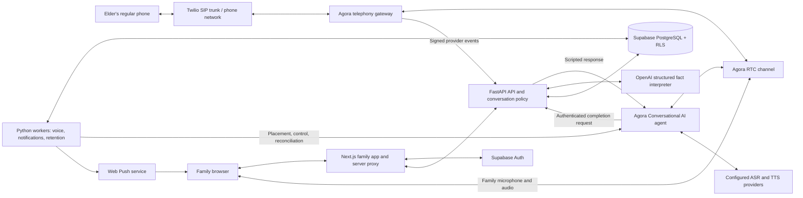
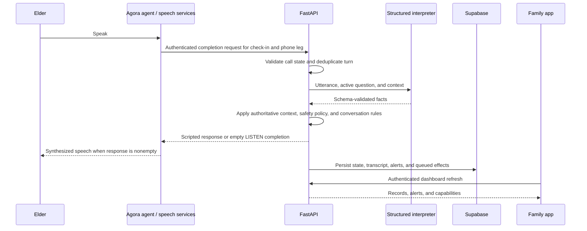

<div align="center">

  

  <h1>Linea</h1>

  <p><strong>Keeping families connected, one LINEA at a time.</strong></p>

  <p>Voice-first check-ins for older adults.<br>Everyday phone calls. Meaningful updates. Family within reach.</p>

  <p>
    
    
    
  </p>

  <p>
    <a href="https://linea.aldrinvitorillo.dev"><strong>Family app ↗</strong></a>
    &nbsp; · &nbsp;
    <a href="testing/README.md">Verification guide</a>
    &nbsp; · &nbsp;
    <a href="IMPLEMENTATION-NOTES.md">Implementation notes</a>
  </p>

  <p><sub>Pronounced <strong>lin-ya</strong>, from the Filipino word <em>linya</em>, meaning “line.”<br>Built for Build Over Nights 2026 · Agora Track (Voice First).</sub></p>

</div>

---

Linea calls the elder on the ordinary phone they already use, asks about their daily routine and wellbeing, and brings family into the conversation when a concern needs attention. Family members use a web dashboard to review check-ins, receive alerts, and join an active call.

| A familiar voice | A clearer picture | A closer connection |
| --- | --- | --- |
| Check-ins on a regular mobile or landline phone, without an app to install. | Summaries, medicine reports, and concern history in one family workspace. | Alerts and the ability to join an eligible live call when family is needed. |

> [!NOTE]
> The MVP is implemented; full browser/phone audio and push acceptance remain unverified in the recorded evidence. See [deployment and implementation status](#deployment-and-implementation-status) for the 4 October 2026 snapshot.

## Contents

| Explore the product | Build and run | Go deeper |
| --- | --- | --- |
| [System overview](#system-overview) | [Run locally](#run-locally) | [Data model and privacy](#data-model-and-privacy) |
| [Features and MVP scope](#features-and-mvp-scope) | [Configuration](#configuration) | [API overview](#api-overview) |
| [System architecture](#system-architecture) | [Repository structure](#repository-structure) | [Testing and verification](#testing-and-verification) |
| [Technology stack](#technology-stack) | [Deployment status](#deployment-and-implementation-status) | [Collaborators](#collaborators) · [Documentation](#project-documentation) |

## System overview

Linea serves two people through different interfaces:

| User | Interface | Purpose |
| --- | --- | --- |
| Elder | Regular mobile or landline phone | Answer a voice check-in without installing an app or navigating a screen. |
| Family member | Browser-based family app | Configure the elder’s routine, review history and concerns, and join an eligible live call. |

A typical check-in follows this flow:

1. The family creates an account and completes four setup steps: elder details, routine, contacts, and review.
2. A first call asks for the elder’s consent. A clear agreement continues into the check-in; refusal stops the call and future automatic calling.
3. Subsequent scheduled calls ask about sleep, medicine, how the elder feels, and anything else they want to share. Answers can arrive out of order without forcing the elder through a rigid questionnaire.
4. Speech is interpreted into structured facts. Backend rules decide whether to clarify, continue, notify family, or use the fixed emergency response.
5. Authorized family can join an eligible active call, hear a briefing, and speak with the elder. Linea enters LISTEN mode during the handoff.
6. The completed logical check-in produces a summary, transcript, medicine result, alerts, and a calendar outcome.

> [!TIP]
> **AI interprets; FastAPI policy decides.** Consent transitions, safety tiers, spoken responses, retries, and lifecycle decisions belong to backend code.

## Features and MVP scope

### Family application

- Email/password signup and sign-in through Supabase Auth.
- Four-step onboarding and editable elder, routine, and contact settings.
- Monthly monitoring charts for check-in activity, daily outcomes, and medicine reports.
- Calendar and day records with summaries, transcripts, and concern history.
- Alert log with an explicit Handled action.
- Call now, family join, microphone mute, leave, and End call for everyone controls.
- Browser push subscription support and a service worker for notifications.
- Responsive dark interface with purple/yellow accents, keyboard focus states, status labels, and contextual tooltips.

The dashboard refreshes through authenticated API polling. Live family audio uses Agora RTC.

### Voice and safety behavior

The MVP conversation language is **English**. It supports five concern types:

| Concern | Meaning |
| --- | --- |
| `FALL` | A reported fall and its relevant context. |
| `BREATHING` | Breathing difficulty. |
| `CHEST_PAIN` | Chest pain or discomfort. |
| `DIZZINESS` | Dizziness and associated context. |
| `MEDICINE_NOT_TAKEN` | A prescribed dose reported as not taken or uncertain. |

Concern type alone does not determine severity. Semantic facts, timing, negation, subject, clarification, and server-owned schedule/history feed deterministic assessment.

| Safety tier | System behavior |
| --- | --- |
| Routine | Quietly notify family and continue the check-in after any needed clarification. |
| Significant | Notify family and explicitly tell the elder that family is being informed. |
| Emergency | Use fixed escalation speech and preserve emergency state; routine questions do not take priority. |

Linea does not generate diagnoses, treatment advice, or medication instructions. Emergency behavior follows the fixed product rules in [the business rules](linea/02-business-rules.md).

Other lifecycle rules include:

- Two initial automatic connection attempts, with one retry **15 minutes after** the first unanswered or failed attempt ends.
- Family notification after the first failure, including the retry plan.
- One separate automatic reconnection after an established conversation unexpectedly drops, preserving unfinished conversation and safety state.
- A successful manual call cancels a pending retry; active-call protection prevents overlapping placements.
- Authenticated manual calls may be requested at any hour. Automatic calls, retries, and reconnections remain within **06:00–21:00 in the elder’s timezone**.
- LISTEN mode is enforced by backend empty completions, rather than relying solely on a prompt.

Calendar precedence is **Red → Yellow → Green**. Significant/Emergency concerns preserve Red history; Routine concerns, uncertain or untaken medicine, and incomplete check-ins contribute Yellow. A successful retry can clear a transient missed-call outcome. Marking an alert Handled does not rewrite the day’s safety history, and missing days do not imply missed doses.

The current MVP supports one medicine and up to three saved contacts per elder. SMS, recorded family introductions, native mobile apps, multilingual conversations, and broader health-management features remain outside this MVP. Saved phone contacts are distinct from authorized family accounts.

## System architecture

### Component layout



### Responsibilities

| Component | Responsibility | Main implementation |
| --- | --- | --- |
| Family web app | Setup, monitoring, records, alerts, and family call controls. | `apps/web/src/components/`, `apps/web/src/app/` |
| Next.js server proxy | Verify the session, check mutation origin, and forward permitted requests with the user’s access token. | `apps/web/src/app/api/backend/[...path]/route.ts` |
| FastAPI | Authenticate family requests, expose records and controls, and host provider callback/completion endpoints. | `services/api/app/main.py`, `provider_routes.py` |
| Semantic interpreter | Extract fact-only structured output from the latest elder utterance and conversation context. | `interpreter.py`, `interpretation.py` |
| Conversation and policy | Apply consent, safety thresholds, clarification, question progression, fixed responses, and LISTEN behavior. | `conversation.py`, `policy.py`, `bridge.py` |
| Lifecycle and runtime | Track logical check-ins and phone legs, coordinate joining/ending, and reconcile retries and provider state. | `lifecycle.py`, `runtime_service.py`, `agora_runtime.py` |
| Persistence | User-scoped family records and a separate privileged runtime repository. | `supabase_repository.py`, `runtime_repository.py` |
| Workers | Plan and execute voice work, deliver notification outbox entries, and expire retained data. | `worker.py`, `scheduler.py`, `notifications.py` |

### How a spoken turn is processed



The default interpreter targets one bounded OpenAI request per new elder turn. It returns facts, not a safety tier or a spoken reply. Pydantic validates the result, and extracted quotations must occur in the elder’s actual utterance. Backend interpretation adds medicine timing and prior history before policy runs.

The repository also includes a retrieval/interpreter extension interface and curated conversation examples. The default runtime uses the direct OpenAI classifier; the extension interface does not establish that a vector database or retrieval service is deployed. An external HTTPS semantic classifier can be configured instead.

### Background processing and recovery

The voice worker runs separately from the HTTP API. It processes a durable provider-event inbox and command queue, evaluates due schedules, reconciles uncertain provider operations, checks family presence, and records a worker heartbeat. Database locks and idempotent operations coordinate placement and state changes. An encrypted emergency recovery journal supports recovery of critical state when persistence fails.

A **logical check-in** can contain multiple **phone legs** for retry or reconnection. Monitoring counts the logical check-in, while phone-leg history preserves the individual connection attempts. Unknown provider outcomes require reconciliation before another placement.

Notification and retention roles use the same worker entry point. Push delivery is tracked through an outbox; push-service acceptance does not prove device receipt or that the family read the alert.

## Technology stack

<details>
<summary><strong>Explore the stack and pinned versions</strong></summary>

Versions below come from the repository manifests, not historical planning documents.

| Layer | Technologies used |
| --- | --- |
| Web framework | **Next.js 16.3.8**, App Router and server route handlers. |
| UI | **React 19.3.0**, **TypeScript 7.0.2**, custom CSS, `lucide-react`, and `bot-avatars`. |
| Web authentication/data client | `@supabase/ssr` 0.12.7 and `@supabase/supabase-js` 2.117.2. |
| Browser audio | `agora-rtc-sdk-ng` 4.24.8 for joining, publishing microphone audio, and subscribing to call audio. |
| Backend | **Python 3.11+**; deployment targets **Python 3.12**, **FastAPI**, **Uvicorn**, and **Pydantic v2**. |
| Backend HTTP integration | `httpx` for Supabase, OpenAI, and provider HTTP requests; `python-dotenv` for local configuration. |
| Voice orchestration | **Agora Conversational AI Engine**, telephony gateway, and RTC. |
| Phone connectivity | **Twilio Elastic SIP Trunking** connected through Agora. |
| Speech recognition/synthesis | ASR and TTS configured in private Agora properties JSON; provider selection is deployment configuration. |
| Semantic interpretation | **OpenAI Chat Completions with strict Structured Outputs**; default model configuration is `gpt-4.1-mini-2025-04-14`. |
| Database and identity | **Supabase PostgreSQL**, **Supabase Auth**, Row Level Security, and database RPCs. |
| Local demo storage | Python **SQLite** repository with synthetic seed records. |
| Notifications and tokens | **Web Push/VAPID**, `pywebpush` 2.5.0, browser service worker, and `agora-token-builder` 1.0.0. |
| Scheduling | Application-owned Python planner and durable worker loop. |
| Package management | **pnpm 11.19.0** workspace, pinned web dependencies, and Python requirements lockfile. |
| Quality tooling | Node test runner via `tsx`, Testing Library, JSDOM, pytest, Ruff, Prettier, and SQL parsing with `pglast`. |
| Deployment | Linux **systemd** services, **Nginx**, HTTPS certificates, and immutable release directories; API Dockerfile included. |

</details>

## Data model and privacy

<details>
<summary><strong>Review data ownership, authorization, and retention</strong></summary>

Supabase migrations define the production data model:

| Data group | Main tables | Purpose |
| --- | --- | --- |
| Enrollment | `elders`, `family_members`, `contacts`, `consents` | Elder routine, account authorization, contact information, and consent evidence. |
| Check-in history | `checkins`, `phone_legs`, `checkin_details` | Logical check-ins, connection attempts, summaries, and transcripts. |
| Concerns | `alerts`, `alert_details` | Structured assessments, exact quotations, and handling state. |
| Presence and events | `family_presence`, `provider_events` | Family membership in calls and event deduplication. |
| Notifications | `notification_outbox`, `push_subscriptions` | Durable alert delivery and registered browser endpoints. |
| Runtime coordination | `linea_runtime`, `linea_runtime_locks`, `linea_commands`, `linea_event_inbox`, `linea_worker_status` | Runtime state, serialization, queued commands/events, and worker readiness. |

Family API requests use the verified user’s JWT for database access, with RLS as a second authorization boundary. Workers use a separate backend service client for privileged mutations. The browser receives only public configuration and authorized call tokens; backend credentials remain private. RTC access is scoped to the authorized call and identity. Provider callbacks require signature and freshness checks, and completion requests require a private bearer.

Retention rules are:

- **90 days:** detailed text, including transcripts, summaries, and alert quotations.
- **365 days:** structured check-in, medicine, alert, and calendar history.
- **While enrolled:** profiles, contacts, and consent records.
- **Raw call audio:** not stored by the application for the MVP.

Retention boundaries are tied to the original check-in end; handling or reading records does not extend them. Provider recording settings, backups, and deletion behavior require their own verification, as described in [the acceptance guide](testing/README.md).

</details>

## Repository structure

```text
Linea/
├── apps/web/                 Next.js family application and web tests
├── services/api/
│   ├── app/                  API, policy, conversation, persistence, and workers
│   ├── data/                 Curated synthetic conversation examples
│   ├── tests/                Backend regression tests
│   └── Dockerfile            API container definition
├── supabase/
│   ├── migrations/           Ordered database schema and runtime changes
│   └── tests/                Database isolation inspection aid
├── contracts/                OpenAPI and semantic-turn JSON schemas
├── scripts/                  Development, preflight, and verification helpers
├── deploy/                   Linux service units and deployment records
├── testing/                  Acceptance guide, conversation cases, and runbooks
├── linea/                    Vision, PRD, business rules, architecture, and design
├── shared/                   Agora platform reference
├── evidence/                 Source inventory
└── references/               Preserved interface design reference material
```

## Run locally

### Prerequisites and installation

Use **Node.js 20.9+**, **pnpm 11.19.0**, and **Python 3.12**. From the repository root:

```powershell
pnpm install --frozen-lockfile
python -m venv .venv
.\.venv\Scripts\python.exe -m pip install -r services/api/requirements.lock.txt
```

Create local environment files only if they do not already exist:

```powershell
if (-not (Test-Path -LiteralPath services/api/.env)) {
    Copy-Item services/api/.env.example services/api/.env
}
if (-not (Test-Path -LiteralPath apps/web/.env.local)) {
    Copy-Item apps/web/.env.local.example apps/web/.env.local
}
```

The API loads `services/api/.env`; Next.js loads `apps/web/.env.local`. Environment variables already supplied by the host take precedence for the API.

### Choose an operating mode

| Mode | Storage and authentication | Calling behavior |
| --- | --- | --- |
| `demo` | Synthetic SQLite records and a local demo session. | Simulated calls and family controls; no real phone or microphone connection. |
| `connected` | Real Supabase Auth and account-scoped records. Default in the example configuration. | Voice/push disabled by default; explicitly scoped voice acceptance testing can be configured. |
| `live` | Supabase plus configured provider integrations. | Requires acceptance evidence matching the configured build. |

For an offline demo, set `LINEA_MODE=demo` in **both** environment files and `NEXT_PUBLIC_LINEA_MODE=demo` in the web environment. Keep `LINEA_VOICE_ENABLED=0` and `LINEA_PUSH_ENABLED=0`; use the same `LINEA_DEMO_API_TOKEN` in both files. No Supabase or voice credentials are needed for that demo.

For the connected workspace, keep both `LINEA_MODE` settings and the web’s `NEXT_PUBLIC_LINEA_MODE` as `connected`. Configure Supabase URL and publishable keys in both environments, apply migrations to a new database in filename order, and configure Supabase email/password authentication. Inspect migration history before changing an existing database. Keep voice and push disabled until their setup and verification are complete.

### Start the API and web app

In terminal 1:

```powershell
cd services/api
..\..\.venv\Scripts\python.exe -m uvicorn app.main:create_app --factory --host 127.0.0.1 --port 8000
```

In terminal 2, from the repository root:

```powershell
pnpm dev
```

Open **http://127.0.0.1:3000/sign-in**. Sign in or create an account in connected mode; choose the demo workspace in demo mode.

- API health: `http://127.0.0.1:8000/health`
- Interactive API documentation: `http://127.0.0.1:8000/docs`
- API schema: `http://127.0.0.1:8000/openapi.json`

Use the same web origin consistently. Set `LINEA_APP_ORIGIN` in the API and `NEXT_PUBLIC_APP_URL` in the web environment to `http://127.0.0.1:3000` for the commands above; keep `LINEA_API_URL=http://127.0.0.1:8000` in the web environment.

Windows helpers are available as `scripts/dev.ps1 -Service api` and `scripts/dev.ps1 -Service web`, run in separate terminals. For fresh demo onboarding, set `LINEA_DEMO_SEED=0` and use a new `LINEA_DATABASE_PATH`.

## Configuration

<details>
<summary><strong>View environment variables and integration settings</strong></summary>

See [the API environment example](services/api/.env.example) and [the web environment example](apps/web/.env.local.example) for the complete variable list.

| Area | Key settings |
| --- | --- |
| Modes and public origins | `LINEA_MODE`, `NEXT_PUBLIC_LINEA_MODE`, `LINEA_API_URL`, `LINEA_APP_ORIGIN`, `NEXT_PUBLIC_APP_URL`, `LINEA_PUBLIC_API_URL` |
| Supabase | `SUPABASE_URL`, `SUPABASE_PUBLISHABLE_KEY`, backend-only `SUPABASE_SERVICE_ROLE_KEY`, and corresponding `NEXT_PUBLIC_SUPABASE_*` values |
| Agora | `AGORA_APP_ID`, `AGORA_APP_CERTIFICATE`, `AGORA_CUSTOMER_ID`, `AGORA_CUSTOMER_SECRET`, `AGORA_FROM_NUMBER`, `LINEA_AGORA_PROPERTIES_FILE` |
| Provider authentication | `LINEA_CUSTOM_LLM_BEARER`, `LINEA_PROVIDER_WEBHOOK_SECRET` |
| Interpreter | `OPENAI_API_KEY`, `LINEA_SEMANTIC_MODEL`, or external `LINEA_SEMANTIC_CLASSIFIER_URL` and `LINEA_SEMANTIC_CLASSIFIER_TOKEN` |
| Scoped voice verification | `LINEA_VOICE_ENABLED`, `LINEA_VOICE_TEST_MODE`, `LINEA_TEST_ELDER_ID`, `LINEA_TEST_OWNER_ID` |
| Live acceptance and recovery | `LINEA_BUILD_ID`, `LINEA_LIVE_ACCEPTANCE_FILE`, `LINEA_RUNTIME_JOURNAL_PATH` |
| Push | `LINEA_PUSH_ENABLED`, `WEB_PUSH_PUBLIC_KEY`, `WEB_PUSH_PRIVATE_KEY`, `WEB_PUSH_SUBJECT`, `NEXT_PUBLIC_WEB_PUSH_PUBLIC_KEY` |
| Local demo | `LINEA_DEMO_API_TOKEN`, `LINEA_DEMO_SEED`, `LINEA_DATABASE_PATH` |

Keep private environment files, speech properties, and acceptance evidence outside Git. Only intended public values belong in `NEXT_PUBLIC_*` variables.

</details>

## API overview

<details>
<summary><strong>Browse family, call-control, and provider endpoints</strong></summary>

Family requests pass through the Next.js `/api/backend/...` proxy. FastAPI exposes these main routes:

| Method | Route | Purpose |
| --- | --- | --- |
| GET | `/health` | Mode, repository, and integration health indicators. |
| GET / POST | `/profiles` | List or create elder profiles. |
| PUT / DELETE | `/profiles/{pid}` | Update a profile or unenroll the elder. |
| GET | `/dashboard` | Monitoring data, alerts, and account capabilities. |
| GET | `/configuration` | Account configuration and readiness. |
| POST | `/profiles/{pid}/call` | Request an eligible manual check-in. |
| GET | `/checkins/{cid}` | Read an authorized check-in record. |
| POST | `/checkins/{cid}/join` | Request authorized RTC join credentials. |
| POST | `/checkins/{cid}/confirm-join` | Confirm provider-backed family presence. |
| POST | `/checkins/{cid}/leave` | Leave the family call. |
| POST | `/checkins/{cid}/end` | Deliberately end the call for everyone. |
| POST | `/checkins/{cid}/alerts/{aid}/handle` | Mark an alert Handled. |
| POST | `/push/subscriptions` | Register a browser push subscription. |
| POST | `/provider/agora/events` | Receive authenticated provider notifications. |
| POST | `/provider/checkins/{cid}/legs/{lid}/chat/completions` | Serve Agora’s authenticated custom completion endpoint. |

Demo-only event, turn, and attempt routes under `/demo/checkins/...` support synthetic review. They are unavailable in connected/live mode. See [the checked-in contract](contracts/openapi.json) and the running API’s `/docs` for request schemas.

</details>

## Testing and verification

Run web checks from the repository root:

```powershell
pnpm typecheck
pnpm test
pnpm build
```

Run backend tests from `services/api`:

```powershell
..\..\.venv\Scripts\python.exe -m pytest
```

The backend suite covers policy, conversation, consent, lifecycle, retries, reconnection, runtime queues, connected API behavior, and verification helpers. Web tests cover monitoring semantics, authentication, request origins, onboarding interaction, and RTC behavior. Curated conversation fixtures and held-out utterances support semantic acceptance testing.

For deployed integration acceptance, follow [testing/README.md](testing/README.md). It maps **22 MVP acceptance requirements** to observable checks for phone audio, family join, LISTEN silence, notifications, authorization, persistence, retention, and cleanup.

Prepare a private results folder from the repository root:

```powershell
.\.venv\Scripts\python.exe scripts/prepare-test-run.py --run-name ready-check-01
```

Results are written under the ignored `artifacts/test-runs/` directory. Synthetic test success and HTTP health checks are separate from real device acceptance.

## Deployment and implementation status

The documented deployment uses three Linux services:

- `linea-web`: Next.js on loopback port 3000.
- `linea-api`: Uvicorn/FastAPI on loopback port 8000.
- `linea-voice`: separate voice worker for scheduled work, provider commands, and reconciliation.

Nginx serves the HTTPS frontend and API. Application code is installed into immutable release directories with `current` symlinks; backend configuration and speech properties live outside the release. Notification and retention worker roles are available through `python -m app.worker`.

Starting the voice worker can process pending and scheduled real calls. Follow the scoped setup, recipient authorization, queue inspection, and read-only preflight in [the deployment guide](deploy/README.md) before execution.

**Status recorded on 4 October 2026:** the family workspace, deterministic policy, structured interpreter, Supabase runtime, Agora integration, and browser audio implementation exist. The deployment record reports a running API and scoped voice worker with verified configuration and heartbeat checks. The deployed frontend and API/worker used different commits at that snapshot. Real authenticated browser/phone audio, push delivery, and the full acceptance suite remain unverified in the recorded evidence; general live mode remains gated.

See [deploy/DEPLOYMENT-20261004.md](deploy/DEPLOYMENT-20261004.md) and [IMPLEMENTATION-NOTES.md](IMPLEMENTATION-NOTES.md) for exact release identifiers and verification limits. This README describes the application and recorded deployment state; it is not a live availability check.

## Collaborators

**Team KEIAS** built Linea for the Agora voice-first track. The team’s collaborators are:

| Collaborator | GitHub | Documented role or repository contributions |
| --- | --- | --- |
| **Keith Ruezyl P. Tagarao** | [@keithruezyl1](https://github.com/keithruezyl1) | Team lead and full stack/AI developer; commits include the MVP scaffold, family workspace, policy/runtime refinements, and verification tooling. |
| **Sting421** | [@Sting421](https://github.com/Sting421) | Repository contributor; commits include Supabase voice runtime, family audio, hosted deployment preparation, and deployment records. |
| **quilluaz** | [@quilluaz](https://github.com/quilluaz) | Team collaborator. |
| **whitefangggggg** | [@whitefangggggg](https://github.com/whitefangggggg) | Team collaborator. |
| **selmvg** | [@selmvg](https://github.com/selmvg) | Team collaborator. |

Contribution descriptions for Keith and Sting421 reflect repository history and do not imply exclusive ownership of those areas.

## Project documentation

For current product decisions, use this authority order: [handoff](HANDOFF-linea-build-over-nights.md), [MVP lock](linea/05-mvp-lock.md), [business rules](linea/02-business-rules.md), then [architecture](linea/03-architecture.md). Some documents preserve earlier plans; their current override sections and implementation notes explain superseding decisions.

<details>
<summary><strong>Open the complete documentation index</strong></summary>

| Document | Purpose |
| --- | --- |
| [HANDOFF-linea-build-over-nights.md](HANDOFF-linea-build-over-nights.md) | Team context and settled implementation decisions. |
| [linea/00-vision.md](linea/00-vision.md) | Long-term product direction beyond this MVP. |
| [linea/01-prd.md](linea/01-prd.md) | Product requirements. |
| [linea/02-business-rules.md](linea/02-business-rules.md) | Deterministic policy and behavior. |
| [linea/03-architecture.md](linea/03-architecture.md) | Architecture background and historical integration plans. |
| [linea/04-design-guidelines.md](linea/04-design-guidelines.md) | Current voice and family-app design guidance. |
| [linea/05-mvp-lock.md](linea/05-mvp-lock.md) | Locked MVP scope. |
| [linea/agent-behavior.md](linea/agent-behavior.md) | Compact agent state contract. |
| [linea/policy-fixtures.yaml](linea/policy-fixtures.yaml) | Machine-readable policy examples. |
| [IMPLEMENTATION-NOTES.md](IMPLEMENTATION-NOTES.md) | Release instructions, verification results, and limits. |
| [00-prerequisites-and-discovery.md](00-prerequisites-and-discovery.md) | Integration prerequisites. |
| [01-test-day-checklist.md](01-test-day-checklist.md) | Acceptance matrix and historical test checklist. |
| [testing/README.md](testing/README.md) | Ordered acceptance procedure and evidence requirements. |
| [testing/RECORDING-RUNBOOK.md](testing/RECORDING-RUNBOOK.md) | Phone and family-browser rehearsal steps. |
| [shared/agora-platform-reference.md](shared/agora-platform-reference.md) | Provider integration reference. |
| [deploy/README.md](deploy/README.md) | Hosted API, web, and worker operations. |
| [evidence/sources.md](evidence/sources.md) | Evidence inventory. |

</details>

---

<p align="center">
  <br>
  <sub><strong>Linea · Team KEIAS</strong><br>Keeping families connected, one LINEA at a time.</sub>
</p>
